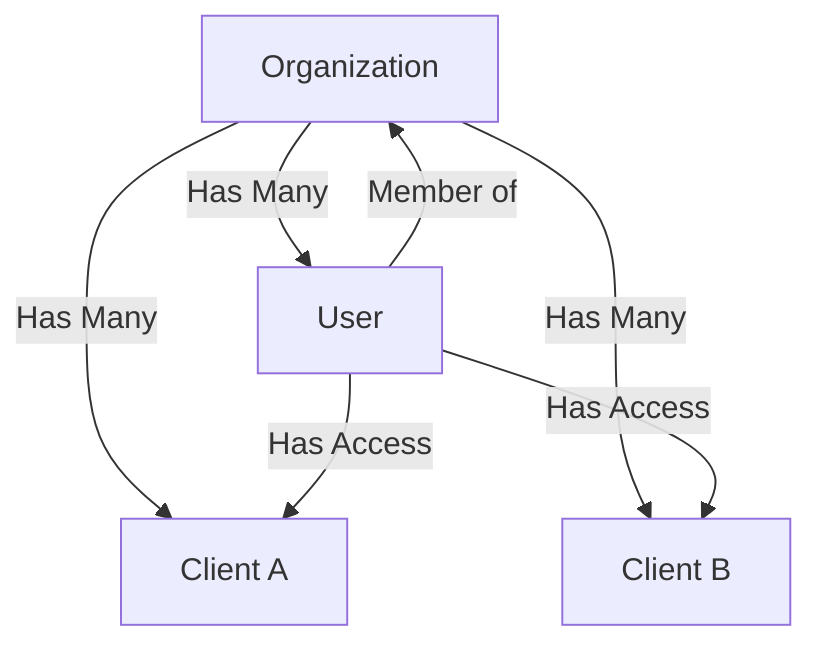

# Client & User Architecture Guide

This document explains how Lumin handles Clients and Users within a single Organization structure, avoiding the need to create a separate Organization for every Client.

## 🏗️ Core Architecture: Single Org, Multiple Clients

Instead of a 1:1 relationship where `Client = Organization`, we use a hierarchical structure:



### Key Benefits
1.  **Unified Billing:** The Organization holds the subscription, not the Client.
2.  **Centralized Management:** Admins can see all Clients in one dashboard.
3.  **Granular Access:** Users can be given access to specific Clients without being Admins of the whole Organization.

---

## 📊 Data Model

The schema relies on a `ClientAccess` join table to link Users to Clients with specific roles.

### `prisma/schema.prisma`

```prisma
model Organization {
  id          String   @id @default(cuid())
  name        String
  // ...
  clients     Client[]
  memberships OrganizationMembership[]
}

model Client {
  id             String         @id @default(cuid())
  organizationId String
  name           String
  // ...
  organization   Organization   @relation(fields: [organizationId], references: [id])
  clientAccesses ClientAccess[] // <--- The Link
  invitations    ClientInvitation[]
}

model User {
  id             String         @id @default(cuid())
  email          String
  // ...
  clientAccesses ClientAccess[] // <--- The Link
}

// The Join Table for Granular Access
model ClientAccess {
  id        String     @id @default(cuid())
  userId    String
  clientId  String
  role      ClientRole @default(VIEWER) // OWNER, EDITOR, VIEWER
  
  user      User       @relation(fields: [userId], references: [id])
  client    Client     @relation(fields: [clientId], references: [id])

  @@unique([userId, clientId]) // Prevent duplicate access records
}

// For inviting users who don't exist yet
model ClientInvitation {
  id        String     @id @default(cuid())
  email     String
  clientId  String
  role      ClientRole
  token     String     @unique // Clerk Invitation ID
  expiresAt DateTime
  // ...
}
```

---

## 🚀 Client Creation

Creating a client is simply creating a record linked to the Organization. No new auth structures are needed.

### `lib/services/client.ts`

```typescript
export async function upsertClient(userId: string, data: UpsertClientInput) {
  const user = await prisma.user.findUnique({ where: { id: userId } });
  // Get the user's active organization
  const orgId = await getUserActiveOrganizationId(userId);

  return await prisma.client.create({
    data: {
      name: data.name,
      organizationId: orgId, // Link to existing Org
      // ...
      // Automatically grant the creator OWNER access
      clientAccesses: {
        create: {
          userId: userId,
          role: "OWNER"
        }
      }
    }
  });
}
```

---

## 💌 User Invitation System

The system handles two scenarios: **Existing Users** and **New Users**.

### Logic Flow (`inviteUser` action)

1.  **Check Permissions:** Does the requester have access to this Client?
2.  **Check Existing User:** Does a user with this email already exist in our DB?
    *   **YES:** Create a `ClientAccess` record immediately. They get instant access.
    *   **NO:** Create a `ClientInvitation` and send an email via Clerk.

### Implementation (`actions.ts`)

```typescript
export async function inviteUser(data: InviteUserSchema) {
  const { clientId, email, role } = data;

  // 1. Check if User Exists
  const existingUser = await prisma.user.findFirst({
    where: { email: email.toLowerCase() },
  });

  if (existingUser) {
    // 2a. Grant Immediate Access
    await prisma.clientAccess.create({
      data: {
        userId: existingUser.id,
        clientId,
        role,
      },
    });
    return { success: true, message: "User granted access" };
  }

  // 2b. Invite New User via Clerk
  const clerkInvitation = await clerkClient.invitations.createInvitation({
    emailAddress: email,
    redirectUrl: `${env.NEXT_PUBLIC_APP_URL}/clients`,
  });

  // 3. Store Invitation Record
  await prisma.clientInvitation.create({
    data: {
      email,
      clientId,
      role,
      token: clerkInvitation.id, // Link to Clerk's invite
      expiresAt: new Date(Date.now() + 7 * 24 * 60 * 60 * 1000),
    },
  });

  return { success: true, message: "Invitation sent" };
}
```

### Handling the Acceptance (Webhook)

When a new user clicks the email link and signs up via Clerk, a webhook fires:

1.  **Webhook:** Creates the `User` record in your DB.
2.  **Post-Creation Logic:**
    *   Look up any `ClientInvitation` records for this email.
    *   For each invitation found:
        *   Create a `ClientAccess` record.
        *   Mark invitation as accepted/deleted.

This ensures that as soon as they sign up, they land in the dashboard with access to the correct Client(s).
